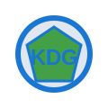
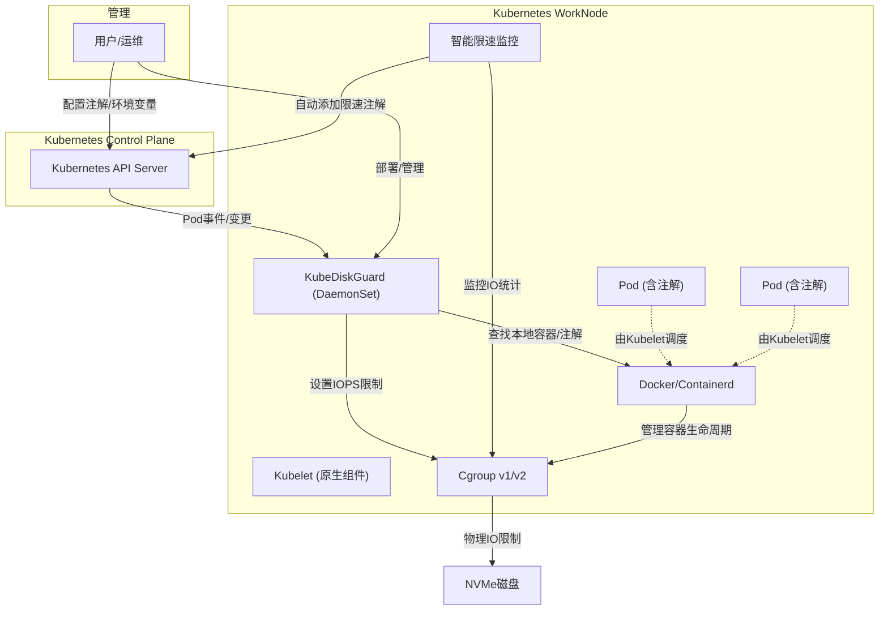

<p align="center">
  
</p>

<h1 align="center">KubeDiskGuard</h1>
<p align="center">Kubernetes 节点级磁盘 IO 资源守护与限速服务</p>

# Kubernetes NVMe 磁盘 IOPS/BPS 限速服务

这是一个用 Go 语言编写的 Kubernetes DaemonSet 服务，用于自动限制容器对 NVMe 磁盘的 IOPS/BPS 访问，防止单个容器的高 IO 操作影响宿主机性能。

## 文档导航

- [用户手册（使用说明、注解/环境变量配置、FAQ）](./docs/USER_GUIDE.md)
- [开发手册（架构、主流程、扩展开发）](./docs/DEV_GUIDE.md)
- [部署手册（镜像构建、DaemonSet部署、生产实践）](./docs/DEPLOY_GUIDE.md)
- [变更历史](./docs/CHANGELOG.md)

---

## 简介与核心特性

- 自动检测容器运行时（Docker/containerd）和 cgroup 版本（v1/v2）
- **以Pod为主索引，所有限速和过滤逻辑均以Pod+containerStatuses为入口，避免全量遍历容器运行时**
- 通过 client-go 监听本节点 Pod 事件，自动为新容器或注解变更的容器设置/调整 IOPS/BPS 限制
- **服务重启时保持IOPS/BPS限制一致性**：重启后会自动获取Pod注解信息，确保现有容器的IOPS/BPS限制与注解配置保持一致
- **优先使用kubelet API**：减少API Server压力，提高性能和可靠性
- **多数据源支持**：支持kubelet API和cgroup文件系统两种IO数据获取方式，自动回退
- 支持多维度过滤（关键字、命名空间、正则、K8s label selector）
- 支持通过注解动态调整单个 Pod 的 IOPS/BPS 限制
- **智能限速功能**：自动监控容器IO使用情况，检测到长时间高IO时自动为Pod添加限速注解
- 配置灵活，环境变量可控
- 健康检查、详细日志、单元测试

## 设计原则与架构亮点

- **以Pod为主索引**：所有业务逻辑（限速、过滤、注解变更等）均以Pod及其containerStatuses为入口，极大提升性能和准确性。
- **运行时只做单容器操作**：只在需要底层操作（如cgroup限速）时，用runtime ID查单个容器详细信息，避免全量遍历。
- **事件监听、注解变更、服务重启等场景全部用Pod+containerStatuses实现**，保证与K8s调度状态强一致。
- **代码结构清晰**：service层负责业务主流程和过滤，runtime层只负责单容器操作。

## 架构图

> IOPS Limit Service 以 DaemonSet agent 方式运行在每个 WorkNode 上，通过 client-go 监听 Kubernetes API Server 的 Pod 事件，**并不是替代 kubelet**，而是作为节点的辅助资源管理服务。



## 主要优化说明

- **所有限速和过滤逻辑均以Pod为主索引**，只遍历K8s已知的业务容器，极大提升性能和准确性。
- **运行时不再支持GetContainersByPod、全量GetContainers等接口**，只保留GetContainerByID、SetIOPSLimit等单容器操作。
- **事件监听、注解变更、服务重启等场景全部用Pod+containerStatuses实现**，避免无谓的全量遍历。
- **代码职责分明**：service层聚焦业务主流程和过滤，runtime层聚焦单容器底层操作。

## 使用说明

### 1. 注解动态调整 IOPS/BPS

在 Pod 的 metadata.annotations 中添加如下注解即可动态调整该 Pod 的 IOPS/BPS 限制：

```yaml
apiVersion: v1
kind: Pod
metadata:
  name: mypod
  annotations:
    iops-limit/read-iops: "1200"   # 读IOPS限制
    iops-limit/write-iops: "800"   # 写IOPS限制
    # 或统一设置
    iops-limit/iops: "1000"        # 读写IOPS都为1000
    # 智能限速注解（自动添加）
    iops-limit/smart-limit: "true" # 标识为智能限速
    iops-limit/auto-iops: "800"    # 自动计算的IOPS值
    iops-limit/auto-bps: "1048576" # 自动计算的BPS值（1MB/s）
    iops-limit/limit-reason: "high-io-detected" # 限速原因
```

- 优先级：`read-iops`/`write-iops` > `iops`
- 注解为0表示解除对应方向的IOPS/BPS限速
- 智能限速注解由系统自动添加，用户无需手动设置

### 2. 过滤机制

- **关键字过滤**：`EXCLUDE_KEYWORDS`，如 `pause,istio-proxy`
- **命名空间过滤**：`EXCLUDE_NAMESPACES`，如 `kube-system,monitoring`
- **LabelSelector过滤**：`EXCLUDE_LABEL_SELECTOR`，支持 K8s 原生 label selector 语法，如 `app=system,env in (prod,staging),!debug`

**示例环境变量配置：**

```yaml
env:
  - name: EXCLUDE_KEYWORDS
    value: "pause,istio-proxy"
  - name: EXCLUDE_NAMESPACES
    value: "kube-system,monitoring"
  - name: EXCLUDE_LABEL_SELECTOR
    value: "app=system,env in (prod,staging),!debug"
```

### 3. 主要环境变量

| 环境变量 | 默认值 | 说明 |
|---------|--------|------|
| `NODE_NAME` |  | 必须，节点名，建议通过Downward API注入 |
| `CONTAINER_READ_IOPS_LIMIT` | 500 | 单个容器的读IOPS限制 |
| `CONTAINER_WRITE_IOPS_LIMIT` | 500 | 单个容器的写IOPS限制 |
| `CONTAINER_IOPS_LIMIT` | 500 | 兼容老配置，若未设置read/write则用此值 |
| `DATA_MOUNT` | /data | 数据盘挂载点 |
| `EXCLUDE_KEYWORDS` | pause,istio-proxy,psmdb,kube-system,koordinator,apisix | 排除的容器关键字 |
| `EXCLUDE_NAMESPACES` | kube-system | 排除的命名空间 |
| `EXCLUDE_LABEL_SELECTOR` |  | K8s label selector 语法 |
| `CONTAINER_RUNTIME` | auto | 容器运行时 |
| `CONTAINER_SOCKET_PATH` | | 容器运行时 `socket` 地址 |
| `CGROUP_VERSION` | auto | cgroup 版本 |
| `KUBELET_HOST` | localhost | kubelet API 主机地址 |
| `KUBELET_PORT` | 10250 | kubelet API 端口 |
| `KUBELET_CA_PATH` |  | kubelet API CA证书路径 |
| `KUBELET_CLIENT_CERT_PATH` |  | kubelet API客户端证书路径 |
| `KUBELET_CLIENT_KEY_PATH` |  | kubelet API客户端私钥路径 |
| `KUBELET_TOKEN_PATH` |  | kubelet API Token路径 |
| `KUBELET_SKIP_VERIFY` |  | kubelet API跳过验证 |
| `SMART_LIMIT_ENABLED` | false | 是否启用智能限速功能 |
| `SMART_LIMIT_MONITOR_INTERVAL` | 60 | 智能限速监控间隔（秒） |
| `SMART_LIMIT_HISTORY_WINDOW` | 10 | 智能限速历史数据窗口（分钟） |
| `SMART_LIMIT_HIGH_IO_THRESHOLD` | 0.8 | 智能限速高IO阈值（百分比） |
| `SMART_LIMIT_HIGH_BPS_THRESHOLD` | 0.8 | 智能限速高BPS阈值（字节/秒） |
| `SMART_LIMIT_AUTO_IOPS` | 0 | 智能限速自动IOPS值（0表示基于当前IO计算） |
| `SMART_LIMIT_AUTO_BPS` | 0 | 智能限速自动BPS值（0表示基于当前IO计算） |
| `SMART_LIMIT_ANNOTATION_PREFIX` | iops-limit | 智能限速注解前缀 |
| `SMART_LIMIT_USE_KUBELET_API` | false | 是否使用kubelet API获取IO数据 |

#### DaemonSet注入节点名示例：
```yaml
env:
  - name: NODE_NAME
    valueFrom:
      fieldRef:
        fieldPath: spec.nodeName
```

#### IOPS注解优先级说明
- `iops-limit/read-iops`、`iops-limit/write-iops` 优先于 `iops-limit/iops`
- 若都未设置，则用全局环境变量
- 注解为0表示解除限速

### 4. 快速开始

1. 构建镜像并推送到仓库
2. 修改 DaemonSet YAML，配置镜像和环境变量
3. 部署到集群：`kubectl apply -f k8s-daemonset.yaml`
4. 查看日志：`kubectl logs -n kube-system -l app=iops-limit-service -f`

#### 智能限速配置示例：

```yaml
env:
  # 启用智能限速
  - name: SMART_LIMIT_ENABLED
    value: "true"
  # 监控间隔60秒
  - name: SMART_LIMIT_MONITOR_INTERVAL
    value: "60"
  # 历史数据窗口10分钟
  - name: SMART_LIMIT_HISTORY_WINDOW
    value: "10"
  # 高IO阈值80%
  - name: SMART_LIMIT_HIGH_IO_THRESHOLD
    value: "0.8"
  # 最小IOPS限速值
  - name: SMART_LIMIT_AUTO_IOPS
    value: "500"
  # 最小BPS限速值（1MB/s）
  - name: SMART_LIMIT_AUTO_BPS
    value: "1048576"
```

### 5. 验证与排查

- 创建测试容器，使用 fio 验证 IOPS/BPS 限制
- 检查 cgroup 路径和限速文件
- 查看服务日志，确认过滤和限速逻辑
- 遇到问题请检查权限、挂载点、cgroup 版本、环境变量配置

## 开发与测试

### 1. 本地开发调试
1. 克隆代码仓库
2. 安装依赖：`go mod download`
3. 配置本地环境变量（可参考上文）
4. 运行服务：`go run main.go`
5. 构建二进制：`go build -o iops-limit-service main.go`
6. 构建镜像：`docker build -t your-repo/iops-limit-service:latest .`

### 2. 单元测试
- 运行所有测试：
  ```bash
  go test -v
  ```
- 你可以参考 `main_test.go` 文件了解更多测试细节。

### 3. 扩展与贡献
- 新增注解支持：在 service.go 中扩展注解解析逻辑
- 支持新运行时：实现 container.Runtime 接口
- 日志与监控：可集成 Prometheus、OpenTelemetry 等
- 贡献代码：Fork、PR、CI 测试

## 故障排查

### 1. 权限问题
确保容器以特权模式运行：
```yaml
securityContext:
  privileged: true
  runAsUser: 0
  runAsGroup: 0
```

### 2. 设备号获取失败
检查数据盘挂载点：
```bash
df /data
lsblk -no PKNAME $(df /data | tail -1 | awk '{print $1}')
```

### 3. cgroup 路径不存在
检查 cgroup 版本和路径：
```bash
# 检查 cgroup 版本
ls /sys/fs/cgroup/cgroup.controllers
# 查找容器 cgroup 路径
find /sys/fs/cgroup -name "*[container-id]*"
```

### 4. 日志与监控
查看服务日志：
```