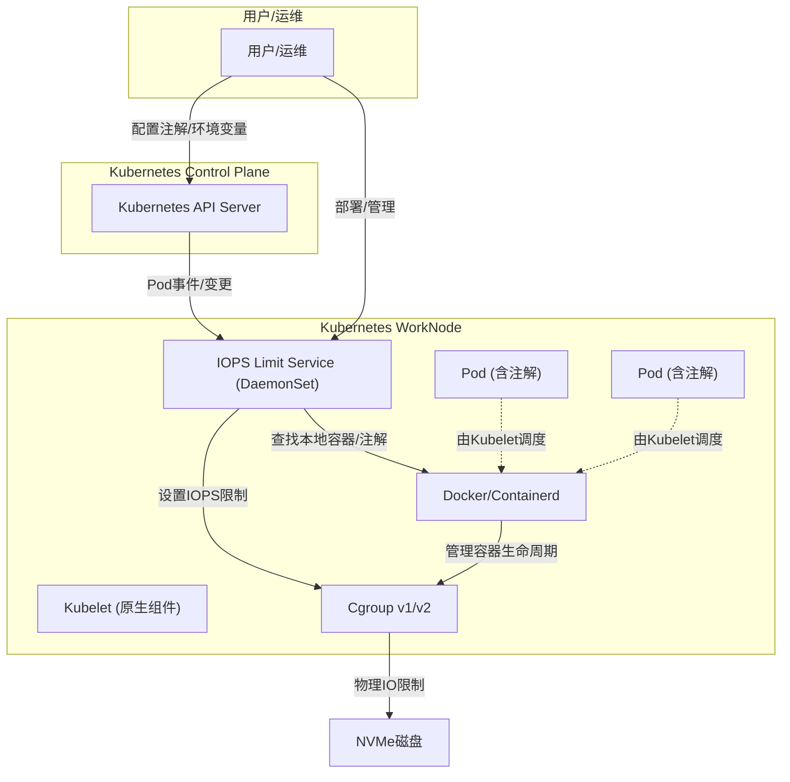

# Kubernetes NVMe 磁盘 IOPS 限速服务

这是一个用 Go 语言编写的 Kubernetes DaemonSet 服务，用于自动限制容器对 NVMe 磁盘的 IOPS 访问，防止单个容器的高 IO 操作影响宿主机性能。

## 核心特性

- 自动检测容器运行时（Docker/containerd）和 cgroup 版本（v1/v2）
- 通过 client-go 监听本节点 Pod 事件，自动为新容器或注解变更的容器设置/调整 IOPS 限制
- 支持多维度过滤（关键字、命名空间、正则、K8s label selector）
- 支持通过注解动态调整单个 Pod 的 IOPS 限制
- 配置灵活，环境变量可控
- 健康检查、详细日志、单元测试

## 架构图

> IOPS Limit Service 以 DaemonSet agent 方式运行在每个 WorkNode 上，通过 client-go 监听 Kubernetes API Server 的 Pod 事件，**并不是替代 kubelet**，而是作为节点的辅助资源管理服务。



## 使用说明

### 1. 注解动态调整 IOPS

在 Pod 的 metadata.annotations 中添加如下注解即可动态调整该 Pod 的 IOPS 限制：

```yaml
apiVersion: v1
kind: Pod
metadata:
  name: mypod
  annotations:
    iops-limit/limit: "1200"
```

### 2. 过滤机制

- **关键字过滤**：`EXCLUDE_KEYWORDS`，如 `pause,istio-proxy`
- **命名空间过滤**：`EXCLUDE_NAMESPACES`，如 `kube-system,monitoring`
- **正则表达式过滤**：`EXCLUDE_REGEXPS`，如 `^istio-.*$`
- **LabelSelector过滤**：`EXCLUDE_LABEL_SELECTOR`，支持 K8s 原生 label selector 语法，如 `app=system,env in (prod,staging),!debug`

**示例环境变量配置：**

```yaml
env:
  - name: EXCLUDE_KEYWORDS
    value: "pause,istio-proxy"
  - name: EXCLUDE_NAMESPACES
    value: "kube-system,monitoring"
  - name: EXCLUDE_REGEXPS
    value: "^istio-.*$"
  - name: EXCLUDE_LABEL_SELECTOR
    value: "app=system,env in (prod,staging),!debug"
```

### 3. 主要环境变量

| 环境变量 | 默认值 | 说明 |
|---------|--------|------|
| `CONTAINER_IOPS_LIMIT` | 500 | 单个容器的 IOPS 限制 |
| `DATA_TOTAL_IOPS` | 3000 | 数据盘总 IOPS 限制 |
| `DATA_MOUNT` | /data | 数据盘挂载点 |
| `EXCLUDE_KEYWORDS` | pause,istio-proxy,psmdb,kube-system,koordinator,apisix | 排除的容器关键字 |
| `EXCLUDE_NAMESPACES` | kube-system | 排除的命名空间 |
| `EXCLUDE_REGEXPS` |  | 排除的正则表达式 |
| `EXCLUDE_LABEL_SELECTOR` |  | K8s label selector 语法 |
| `CONTAINERD_NAMESPACE` | k8s.io | containerd 命名空间 |
| `CONTAINER_RUNTIME` | auto | 容器运行时 |
| `CGROUP_VERSION` | auto | cgroup 版本 |
| `CHECK_INTERVAL` | 30 | 检查间隔（秒） |

### 4. 快速开始

1. 构建镜像并推送到仓库
2. 修改 DaemonSet YAML，配置镜像和环境变量
3. 部署到集群：`kubectl apply -f k8s-daemonset.yaml`
4. 查看日志：`kubectl logs -n kube-system -l app=iops-limit-service -f`

### 5. 验证与排查

- 创建测试容器，使用 fio 验证 IOPS 限制
- 检查 cgroup 路径和限速文件
- 查看服务日志，确认过滤和限速逻辑
- 遇到问题请检查权限、挂载点、cgroup 版本、环境变量配置

## 开发与测试

### 1. 本地开发调试
1. 克隆代码仓库
2. 安装依赖：`go mod download`
3. 配置本地环境变量（可参考上文）
4. 运行服务：`go run main.go`
5. 构建二进制：`go build -o iops-limit-service main.go`
6. 构建镜像：`docker build -t your-repo/iops-limit-service:latest .`

### 2. 单元测试
- 运行所有测试：
  ```bash
  go test -v
  ```
- 你可以参考 `main_test.go` 文件了解更多测试细节。

### 3. 扩展与贡献
- 新增注解支持：在 service.go 中扩展注解解析逻辑
- 支持新运行时：实现 container.Runtime 接口
- 日志与监控：可集成 Prometheus、OpenTelemetry 等
- 贡献代码：Fork、PR、CI 测试

## 故障排查

### 1. 权限问题
确保容器以特权模式运行：
```yaml
securityContext:
  privileged: true
  runAsUser: 0
  runAsGroup: 0
```

### 2. 设备号获取失败
检查数据盘挂载点：
```bash
df /data
lsblk -no PKNAME $(df /data | tail -1 | awk '{print $1}')
```

### 3. cgroup 路径不存在
检查 cgroup 版本和路径：
```bash
# 检查 cgroup 版本
ls /sys/fs/cgroup/cgroup.controllers
# 查找容器 cgroup 路径
find /sys/fs/cgroup -name "*[container-id]*"
```

### 4. 日志与监控
查看服务日志：
```bash
kubectl logs -n kube-system -l app=iops-limit-service -f
```
服务会输出配置信息、容器检测和过滤、IOPS 限制设置、错误信息等。

### 5. 健康检查
服务包含 liveness 和 readiness 探针，确保服务正常运行。

## 单元测试

本项目已包含完善的单元测试，覆盖注解解析、容器查找、动态限速、过滤逻辑等核心功能。

运行所有测试：

```bash
go test -v
```

## 常见问题与注意事项

- 注解变更后通常几秒内自动生效
- 推荐 K8s 1.20+，理论上 1.16+ 兼容
- 仅主支持单数据盘挂载点，如需多盘可扩展
- IOPS 限制只对整个 NVMe 设备生效，不对分区生效
- 需以特权模式运行，访问 cgroup 和容器运行时
- 正确配置过滤关键字，避免影响系统容器
- 服务包含健康检查和详细日志输出

## 许可证

MIT License 