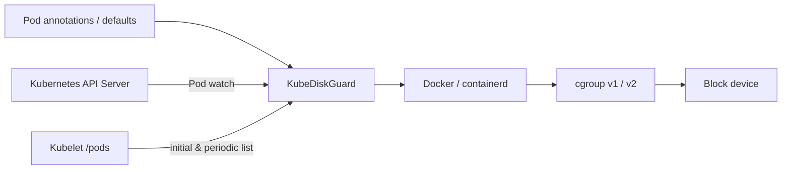

<p align="center">
  
</p>

<h1 align="center">KubeDiskGuard</h1>
<p align="center">Kubernetes 节点级、声明式磁盘 IO 限速执行器</p>

KubeDiskGuard 以 DaemonSet 运行在每个节点。它监听本节点 Pod 变更，解析静态 IOPS/BPS 策略，定位容器的 cgroup，并将限制写入 cgroup v1 或 v2。

项目不包含自动阈值判定、历史趋势分析或自动修改 Pod 注解；限速策略始终由用户或上层控制面声明。

## 工作方式


```mermaid
flowchart LR
    Policy[Pod annotations / defaults] --> Agent[KubeDiskGuard]
    APIServer[Kubernetes API Server] -->|Pod watch| Agent
    Kubelet[Kubelet /pods] -->|initial & periodic list| Agent
    Agent --> Runtime[Docker / containerd]
    Runtime --> Cgroup[cgroup v1 / v2]
    Cgroup --> Disk[Block device]
```

- 事件驱动：Pod 新建或修改时立即执行策略。
- 周期对账：默认每 300 秒重新枚举并下发全部策略，覆盖容器重建、Agent 重启与 watch 中断。
- 可观测：`/metrics` 提供下发、对账和目标限额指标；`/readyz` 仅在至少一次成功对账后返回成功。

## 部署

```bash
make build
kubectl apply -f k8s-daemonset.yaml
```

DaemonSet 必须具备：容器运行时 socket、`/sys/fs/cgroup`、目标数据盘挂载、节点名以及读取 Pod 的 RBAC 权限。当前示例为特权部署；生产环境请按实际 runtime 和数据盘调整挂载项。

## 策略

策略优先级为：**当前注解 > 兼容注解 > 节点默认值**。

```yaml
apiVersion: v1
kind: Pod
metadata:
  name: example
  annotations:
    # 统一设置读写 IOPS 或 BPS
    kubediskguard.io/iops: "1000"
    kubediskguard.io/bps: "10MiB"

    # 下列定向策略优先于统一策略的默认值
    kubediskguard.io/read-iops: "800"
    kubediskguard.io/write-iops: "600"
    kubediskguard.io/read-bps: "5MiB"
    kubediskguard.io/write-bps: "2MiB"
```

`<annotation-prefix>/removed: "true"` 会解除该 Pod 容器的全部 IOPS/BPS 限制。默认前缀是 `kubediskguard.io`，可通过 `ANNOTATION_PREFIX` 修改。旧的 `nvme-iops`、`nvme-iops-read`、`nvme-iops-write`、`nvme-bps`、`nvme-bps-read`、`nvme-bps-write` 仍作为兼容策略读取。

## 主要配置

| 环境变量 | 默认值 | 说明 |
| --- | --- | --- |
| `NODE_NAME` | 无 | 必填；通过 Downward API 注入节点名。 |
| `CONTAINER_READ_IOPS_LIMIT` | `500` | 未匹配注解时的默认读 IOPS。 |
| `CONTAINER_WRITE_IOPS_LIMIT` | `500` | 未匹配注解时的默认写 IOPS。 |
| `CONTAINER_READ_BPS_LIMIT` | `0` | 未匹配注解时的默认读带宽，`0` 表示不限。 |
| `CONTAINER_WRITE_BPS_LIMIT` | `0` | 未匹配注解时的默认写带宽，`0` 表示不限。 |
| `ANNOTATION_PREFIX` | `kubediskguard.io` | 静态策略注解前缀。 |
| `RECONCILE_INTERVAL` | `300` | 周期性全量对账间隔（秒）。 |
| `DATA_MOUNT` | `/data` | 需要限制的块设备挂载点。 |
| `CONTAINER_RUNTIME` | `auto` | `docker`、`containerd` 或自动检测。 |
| `CONTAINER_SOCKET_PATH` | containerd socket | 运行时 socket 路径。 |
| `CGROUP_VERSION` | `auto` | `v1`、`v2` 或自动检测。 |
| `EXCLUDE_KEYWORDS` | 内置列表 | 按容器名或镜像名跳过。 |
| `EXCLUDE_NAMESPACES` | `kube-system` | 跳过命名空间。 |
| `EXCLUDE_LABEL_SELECTOR` | 空 | 跳过匹配 Kubernetes label selector 的 Pod。 |

## 运维接口

| 路径 | 用途 |
| --- | --- |
| `/healthz` | 进程存活。 |
| `/readyz` | 最近一次全量对账是否成功。 |
| `/metrics` | Prometheus 指标。 |
| `/api/v1/limits` | 最近成功下发的容器级限额，可用 `namespace`、`pod` 过滤。 |
| `/api/v1/limits/{containerID}` | 查询单个容器的最近成功下发状态。 |
| `/api/v1/health` | 服务健康与对账状态。 |

## 开发验证

```bash
go test ./...
```

生产上线前请在代表性的 Docker/containerd、cgroup v1/v2 和数据盘布局上验证：目标 cgroup 路径、设备主次号、`io.max`/`blkio` 的实际写入结果，以及 Pod 重建后的自动对账。
