<p align="center">
  
</p>

<h1 align="center">KubeDiskGuard</h1>
<p align="center">Kubernetes 节点级磁盘 IO 资源守护与限速服务</p>

# Kubernetes NVMe 磁盘 IOPS 限速服务

一个基于 Go 语言的 Kubernetes 节点级磁盘 IO 资源守护与限速服务，作为 DaemonSet 运行在每个工作节点上，通过 client-go 监听 Pod 事件，根据 Pod 注解动态调整容器的 IOPS/BPS 限制。

## 核心特性

### 🚀 主要功能
- **动态 IOPS/BPS 限速**: 根据 Pod 注解实时调整容器磁盘 IO 限制
- **智能限速**: 基于 cAdvisor 指标自动检测高 IO 容器并应用限速
- **多运行时支持**: 支持 Docker 和 Containerd 容器运行时
- **cgroup 兼容**: 支持 cgroup v1 和 v2
- **注解驱动**: 通过 Kubernetes Pod 注解配置限速策略

### 🏗️ 架构优化
- **保留 cgroup 限速操作**: 继续使用 cgroup 文件系统进行实际的 IO 限速
- **删除 cgroup 计算功能**: 移除通过 cgroup 文件系统计算 IOPS/BPS 的复杂逻辑
- **kubelet API 集成**: 通过 kubelet API 获取 cAdvisor 数据，简化复杂度
- **统一数据源**: 智能限速和监控都使用 kubelet API 作为数据源

## 工作原理

### 1. 限速机制

```mermaid
graph TD
    A[Pod 注解变更] --> B[client-go 监听]
    B --> C[解析 IOPS/BPS 限制]
    C --> D[查找容器 cgroup 路径]
    D --> E[写入 cgroup 限速文件]
    E --> F[容器 IO 被限制]
```


### 2. 智能限速流程

```mermaid
graph TD
    A[kubelet API] --> B[cAdvisor 指标]
    B --> C[IO 趋势分析]
    C --> D{是否超过阈值?}
    D -->|是| E[更新 Pod 注解]
    E --> F[触发限速]
    D -->|否| G[继续监控]
```


### 3. 数据流优化
- **历史方案**: cgroup 文件读取 → 复杂解析 → IO 计算
- **优化方案**: kubelet API → cAdvisor 指标 → 直接计算

## 快速开始

### 1. 部署服务

```bash
# 克隆项目
git clone <repository-url>
cd io-limit-service

# 构建镜像
make build

# 部署 DaemonSet
kubectl apply -f k8s-daemonset.yaml
```

### 2. 配置 Pod 注解

```yaml
apiVersion: v1
kind: Pod
metadata:
  name: example-pod
  annotations:
    # 统一 IOPS 限制
    io-limit: "1000"
    
    # 分别设置读写 IOPS
    io-limit/read: "800"
    io-limit/write: "600"
    
    # 分别设置读写 BPS (字节/秒)
    io-limit/read-bps: "1048576"  # 1MB/s
    io-limit/write-bps: "524288"  # 512KB/s
spec:
  containers:
  - name: app
    image: nginx
```

### 3. 启用智能限速

```yaml
apiVersion: v1
kind: ConfigMap
metadata:
  name: io-limit-config
data:
  config.json: |
    {
      "smart_limit_enabled": true,
      "smart_limit_monitor_interval": 60,
      "smart_limit_high_io_threshold": 0.8,
      "smart_limit_auto_iops": 500,
      "smart_limit_auto_bps": 1048576,
      "smart_limit_annotation_prefix": "io-limit"
    }
```

## 配置说明

### 基础配置

| 配置项 | 默认值 | 说明 |
|--------|--------|------|
| `container_iops_limit` | 500 | 默认 IOPS 限制 |
| `container_read_iops_limit` | 500 | 默认读 IOPS 限制 |
| `container_write_iops_limit` | 500 | 默认写 IOPS 限制 |
| `container_read_bps_limit` | 0 | 默认读 BPS 限制 |
| `container_write_bps_limit` | 0 | 默认写 BPS 限制 |

### 智能限速配置

| 配置项 | 默认值 | 说明 |
|--------|--------|------|
| `smart_limit_enabled` | false | 是否启用智能限速 |
| `smart_limit_monitor_interval` | 60 | 监控间隔（秒） |
| `smart_limit_history_window` | 10 | 历史数据窗口（分钟） |
| `smart_limit_high_io_threshold` | 0.8 | 高 IO 阈值 |
| `smart_limit_auto_iops` | 0 | 自动限速 IOPS 值 |
| `smart_limit_auto_bps` | 0 | 自动限速 BPS 值 |

### kubelet API 配置

| 配置项 | 默认值 | 说明 |
|--------|--------|------|
| `kubelet_host` | localhost | kubelet 主机地址 |
| `kubelet_port` | 10250 | kubelet 端口 |
| `smart_limit_use_kubelet_api` | true | 是否使用 kubelet API |
| `kubelet_skip_verify` | false | 是否跳过证书验证 |

## 架构优势

### 1. 简化复杂度
- **删除 cgroup 计算**: 移除复杂的 cgroup 文件解析逻辑
- **统一数据源**: 所有 IO 数据都来自 kubelet API
- **减少依赖**: 不再需要直接读取 cgroup 文件系统

### 2. 提高可靠性
- **kubelet API**: 使用官方 API 接口，更加稳定
- **cAdvisor 集成**: 利用成熟的 cAdvisor 指标系统
- **错误处理**: 更好的错误处理和回退机制

### 3. 增强性能
- **减少文件 I/O**: 不再频繁读取 cgroup 文件
- **优化计算**: 直接使用 cAdvisor 计算的指标
- **内存效率**: 减少不必要的数据结构

## 监控与调试

### 查看服务日志
```bash
# 查看 DaemonSet 日志
kubectl logs -n kube-system -l app=io-limit-service

# 查看特定节点日志
kubectl logs -n kube-system -l app=io-limit-service -o wide | grep <node-name>
```

### 检查 cgroup 限速
```bash
# 进入容器查看 cgroup 限制
docker exec -it <container-id> cat /sys/fs/cgroup/blkio/blkio.throttle.read_iops_device
docker exec -it <container-id> cat /sys/fs/cgroup/blkio/blkio.throttle.write_iops_device
```

### 测试 kubelet API
```bash
# 测试 kubelet API 连接
curl -k https://localhost:10250/stats/summary

# 测试 cAdvisor 指标
curl -k https://localhost:10250/metrics/cadvisor
```

## 故障排除

### 常见问题

1. **kubelet API 连接失败**
   - 检查 kubelet 是否运行在 10250 端口
   - 确认 ServiceAccount 权限
   - 检查证书配置

2. **cgroup 限速不生效**
   - 确认 cgroup 版本 (v1/v2)
   - 检查容器运行时支持
   - 验证设备 major:minor 号

3. **智能限速不触发**
   - 检查监控间隔配置
   - 确认 IO 阈值设置
   - 查看历史数据收集

## 开发指南

### 项目结构
```
├── cmd/                    # 命令行工具
├── pkg/
│   ├── cgroup/            # cgroup 限速操作
│   ├── config/            # 配置管理
│   ├── container/         # 容器运行时接口
│   ├── detector/          # 运行时检测
│   ├── kubeclient/        # Kubernetes 客户端
│   ├── kubelet/           # kubelet API 客户端
│   ├── runtime/           # 容器运行时实现
│   ├── service/           # 主服务逻辑
│   └── smartlimit/        # 智能限速模块
├── docs/                  # 文档
├── examples/              # 示例配置
└── scripts/               # 部署脚本
```

### 构建测试
```bash
# 运行单元测试
go test ./...

# 构建二进制文件
make build

# 运行集成测试
make test-integration
```

## 贡献指南

欢迎提交 Issue 和 Pull Request！

1. Fork 项目
2. 创建功能分支
3. 提交更改
4. 推送到分支
5. 创建 Pull Request

## 许可证

MIT License

## 更新日志

### v2.2.0 (最新)
- 🚀 **智能限速功能重大升级**: 新增完整的智能限速功能，支持自动监控容器IO使用情况并动态调整限速
- 📊 **kubelet API集成**: 新增kubelet API客户端，支持通过kubelet API获取容器IO统计信息
- 🔧 **cAdvisor计算器**: 新增cAdvisor指标计算模块，支持IOPS和BPS趋势分析
- 📚 **文档完善**: 新增智能限速指南、kubelet API集成文档等完整文档体系
- 🛠️ **开发工具**: 新增测试工具和脚本，支持高级测试场景

### v2.1.0
- **注解前缀统一**: 将所有注解前缀从 `iops-limit` 统一变更为 `io-limit`
- **注解解析优化**: 明确优先级和0值处理逻辑
- **测试用例修正**: 更新所有相关测试用例，确保测试通过
- **文档同步更新**: 所有文档中的注解示例全部更新

### v2.0.0
- 🚀 **架构优化**: 删除 cgroup 计算功能，通过 kubelet API 获取 cAdvisor 数据
- 🔧 **简化复杂度**: 统一数据源，减少文件 I/O 操作
- 📈 **提高性能**: 优化内存使用和计算效率
- 🛡️ **增强可靠性**: 更好的错误处理和回退机制

### v1.x.x
- 初始版本功能实现
- 基础 IOPS/BPS 限速
- 智能限速功能
- 多运行时支持

## 文档导航

- [用户手册（使用说明、注解/环境变量配置、FAQ）](./docs/USER_GUIDE.md)
- [开发手册（架构、主流程、扩展开发）](./docs/DEV_GUIDE.md)
- [部署手册（镜像构建、DaemonSet部署、生产实践）](./docs/DEPLOY_GUIDE.md)
- [变更历史](./docs/CHANGELOG.md)
- [v2.2.0详细变更日志](./docs/V2.2.0_CHANGELOG_DETAILED.md)
- [文档更新总结（注解前缀变更详情）](./docs/DOCUMENTATION_UPDATE_SUMMARY.md)

---

## 简介与核心特性

- 自动检测容器运行时（Docker/containerd）和 cgroup 版本（v1/v2）
- **以Pod为主索引，所有限速和过滤逻辑均以Pod+containerStatuses为入口，避免全量遍历容器运行时**
- 通过 client-go 监听本节点 Pod 事件，自动为新容器或注解变更的容器设置/调整 IOPS/BPS 限制
- **服务重启时保持IOPS/BPS限制一致性**：重启后会自动获取Pod注解信息，确保现有容器的IOPS/BPS限制与注解配置保持一致
- **优先使用kubelet API**：减少API Server压力，提高性能和可靠性
- **多数据源支持**：支持kubelet API和cgroup文件系统两种IO数据获取方式，自动回退
- 支持多维度过滤（关键字、命名空间、正则、K8s label selector）
- 支持通过注解动态调整单个 Pod 的 IOPS/BPS 限制
- **智能限速功能**：自动监控容器IO使用情况，检测到长时间高IO时自动为Pod添加限速注解
- 配置灵活，环境变量可控
- 健康检查、详细日志、单元测试

## 设计原则与架构亮点

- **以Pod为主索引**：所有业务逻辑（限速、过滤、注解变更等）均以Pod及其containerStatuses为入口，极大提升性能和准确性。
- **运行时只做单容器操作**：只在需要底层操作（如cgroup限速）时，用runtime ID查单个容器详细信息，避免全量遍历。
- **事件监听、注解变更、服务重启等场景全部用Pod+containerStatuses实现**，保证与K8s调度状态强一致。
- **代码结构清晰**：service层负责业务主流程和过滤，runtime层只负责单容器底层操作。

## 架构图

> IOPS Limit Service 以 DaemonSet agent 方式运行在每个 WorkNode 上，通过 client-go 监听 Kubernetes API Server 的 Pod 事件，**并不是替代 kubelet**，而是作为节点的辅助资源管理服务。

```mermaid
flowchart TD
    subgraph "Kubernetes WorkNode"
        direction TB
        Kubelet["Kubelet (原生组件)"]
        Runtime["Docker/Containerd"]
        Service["KubeDiskGuard (DaemonSet)"]
        SmartLimit["智能限速监控"]
        Cgroup["Cgroup v1/v2"]
        Pod1["Pod (含注解)"]
        Pod2["Pod (含注解)"]
    end
    subgraph "Kubernetes Control Plane"
        APIServer["Kubernetes API Server"]
    end
    APIServer -- "Pod事件/变更" --> Service
    Service -- "查找本地容器/注解" --> Runtime
    Service -- "设置IOPS限制" --> Cgroup
    SmartLimit -- "监控IO统计" --> Cgroup
    SmartLimit -- "自动添加限速注解" --> APIServer
    Runtime -- "管理容器生命周期" --> Cgroup
    Pod1 -. "由Kubelet调度" .-> Runtime
    Pod2 -. "由Kubelet调度" .-> Runtime
    subgraph "管理"
        User["用户/运维"]
    end
    User -- "配置注解/环境变量" --> APIServer
    User -- "部署/管理" --> Service
    Cgroup -- "物理IO限制" --> NVMe["NVMe磁盘"]
```



## 主要优化说明

- **所有限速和过滤逻辑均以Pod为主索引**，只遍历K8s已知的业务容器，极大提升性能和准确性。
- **运行时不再支持GetContainersByPod、全量GetContainers等接口**，只保留GetContainerByID、SetIOPSLimit等单容器操作。
- **事件监听、注解变更、服务重启等场景全部用Pod+containerStatuses实现**，避免无谓的全量遍历。
- **代码职责分明**：service层聚焦业务主流程和过滤，runtime层聚焦单容器底层操作。

## 使用说明

### 1. 注解动态调整 IOPS/BPS

在 Pod 的 metadata.annotations 中添加如下注解即可动态调整该 Pod 的 IOPS/BPS 限制：

```yaml
apiVersion: v1
kind: Pod
metadata:
  name: mypod
  annotations:
    io-limit/read-iops: "1200"   # 读IOPS限制
    io-limit/write-iops: "800"   # 写IOPS限制
    # 或统一设置
    io-limit/iops: "1000"        # 读写IOPS都为1000
    # 智能限速注解（自动添加）
    io-limit/smart-limit: "true" # 标识为智能限速
    io-limit/auto-iops: "800"    # 自动计算的IOPS值
    io-limit/auto-bps: "1048576" # 自动计算的BPS值（1MB/s）
    io-limit/limit-reason: "high-io-detected" # 限速原因
```

- 优先级：`read-iops`/`write-iops` > `iops`
- 注解为0表示解除对应方向的IOPS/BPS限速
- 智能限速注解由系统自动添加，用户无需手动设置

### 2. 过滤机制

- **关键字过滤**：`EXCLUDE_KEYWORDS`，如 `pause,istio-proxy`
- **命名空间过滤**：`EXCLUDE_NAMESPACES`，如 `kube-system,monitoring`
- **LabelSelector过滤**：`EXCLUDE_LABEL_SELECTOR`，支持 K8s 原生 label selector 语法，如 `app=system,env in (prod,staging),!debug`

**示例环境变量配置：**

```yaml
env:
  - name: EXCLUDE_KEYWORDS
    value: "pause,istio-proxy"
  - name: EXCLUDE_NAMESPACES
    value: "kube-system,monitoring"
  - name: EXCLUDE_LABEL_SELECTOR
    value: "app=system,env in (prod,staging),!debug"
```

### 3. 主要环境变量

| 环境变量 | 默认值 | 说明 |
|---------|--------|------|
| `NODE_NAME` |  | 必须，节点名，建议通过Downward API注入 |
| `CONTAINER_READ_IOPS_LIMIT` | 500 | 单个容器的读IOPS限制 |
| `CONTAINER_WRITE_IOPS_LIMIT` | 500 | 单个容器的写IOPS限制 |
| `CONTAINER_IOPS_LIMIT` | 500 | 兼容老配置，若未设置read/write则用此值 |
| `DATA_MOUNT` | /data | 数据盘挂载点 |
| `EXCLUDE_KEYWORDS` | pause,istio-proxy,psmdb,kube-system,koordinator,apisix | 排除的容器关键字 |
| `EXCLUDE_NAMESPACES` | kube-system | 排除的命名空间 |
| `EXCLUDE_LABEL_SELECTOR` |  | K8s label selector 语法 |
| `CONTAINER_RUNTIME` | auto | 容器运行时 |
| `CONTAINER_SOCKET_PATH` | | 容器运行时 `socket` 地址 |
| `CGROUP_VERSION` | auto | cgroup 版本 |
| `KUBELET_HOST` | localhost | kubelet API 主机地址 |
| `KUBELET_PORT` | 10250 | kubelet API 端口 |
| `KUBELET_CA_PATH` |  | kubelet API CA证书路径 |
| `KUBELET_CLIENT_CERT_PATH` |  | kubelet API客户端证书路径 |
| `KUBELET_CLIENT_KEY_PATH` |  | kubelet API客户端私钥路径 |
| `KUBELET_TOKEN_PATH` |  | kubelet API Token路径 |
| `KUBELET_SKIP_VERIFY` |  | kubelet API跳过验证 |
| `SMART_LIMIT_ENABLED` | false | 是否启用智能限速功能 |
| `SMART_LIMIT_MONITOR_INTERVAL` | 60 | 智能限速监控间隔（秒） |
| `SMART_LIMIT_HISTORY_WINDOW` | 10 | 智能限速历史数据窗口（分钟） |
| `SMART_LIMIT_HIGH_IO_THRESHOLD` | 0.8 | 智能限速高IO阈值（百分比） |
| `SMART_LIMIT_HIGH_BPS_THRESHOLD` | 0.8 | 智能限速高BPS阈值（字节/秒） |
| `SMART_LIMIT_AUTO_IOPS` | 0 | 智能限速自动IOPS值（0表示基于当前IO计算） |
| `SMART_LIMIT_AUTO_BPS` | 0 | 智能限速自动BPS值（0表示基于当前IO计算） |
| `SMART_LIMIT_ANNOTATION_PREFIX` | io-limit | 智能限速注解前缀 |
| `SMART_LIMIT_USE_KUBELET_API` | false | 是否使用kubelet API获取IO数据 |

#### DaemonSet注入节点名示例：
```yaml
env:
  - name: NODE_NAME
    valueFrom:
      fieldRef:
        fieldPath: spec.nodeName
```

#### IOPS注解优先级说明
- `io-limit/read-iops`、`io-limit/write-iops` 优先于 `io-limit/iops`
- 若都未设置，则用全局环境变量
- 注解为0表示解除限速

### 4. 快速开始

1. 构建镜像并推送到仓库
2. 修改 DaemonSet YAML，配置镜像和环境变量
3. 部署到集群：`kubectl apply -f k8s-daemonset.yaml`
4. 查看日志：`kubectl logs -n kube-system -l app=io-limit-service -f`

#### 智能限速配置示例：

```yaml
env:
  # 启用智能限速
  - name: SMART_LIMIT_ENABLED
    value: "true"
  # 监控间隔60秒
  - name: SMART_LIMIT_MONITOR_INTERVAL
    value: "60"
  # 历史数据窗口10分钟
  - name: SMART_LIMIT_HISTORY_WINDOW
    value: "10"
  # 高IO阈值80%
  - name: SMART_LIMIT_HIGH_IO_THRESHOLD
    value: "0.8"
  # 最小IOPS限速值
  - name: SMART_LIMIT_AUTO_IOPS
    value: "500"
  # 最小BPS限速值（1MB/s）
  - name: SMART_LIMIT_AUTO_BPS
    value: "1048576"
```

### 5. 验证与排查

- 创建测试容器，使用 fio 验证 IOPS/BPS 限制
- 检查 cgroup 路径和限速文件
- 查看服务日志，确认过滤和限速逻辑
- 遇到问题请检查权限、挂载点、cgroup 版本、环境变量配置

## 开发与测试

### 1. 本地开发调试
1. 克隆代码仓库
2. 安装依赖：`go mod download`
3. 配置本地环境变量（可参考上文）
4. 运行服务：`go run main.go`
5. 构建二进制：`go build -o io-limit-service main.go`
6. 构建镜像：`docker build -t your-repo/io-limit-service:latest .`

### 2. 单元测试
- 运行所有测试：
  ```bash
  go test -v
  ```
- 你可以参考 `main_test.go` 文件了解更多测试细节。

### 3. 扩展与贡献
- 新增注解支持：在 service.go 中扩展注解解析逻辑
- 支持新运行时：实现 container.Runtime 接口
- 日志与监控：可集成 Prometheus、OpenTelemetry 等
- 贡献代码：Fork、PR、CI 测试

## 故障排查

### 1. 权限问题
确保容器以特权模式运行：
```yaml
securityContext:
  privileged: true
  runAsUser: 0
  runAsGroup: 0
```

### 2. 设备号获取失败
检查数据盘挂载点：
```bash
df /data
lsblk -no PKNAME $(df /data | tail -1 | awk '{print $1}')
```

### 3. cgroup 路径不存在
检查 cgroup 版本和路径：
```bash
# 检查 cgroup 版本
ls /sys/fs/cgroup/cgroup.controllers
# 查找容器 cgroup 路径
find /sys/fs/cgroup -name "*[container-id]*"
```

### 4. 日志与监控
查看服务日志：
```