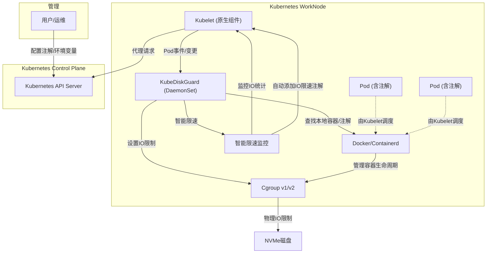
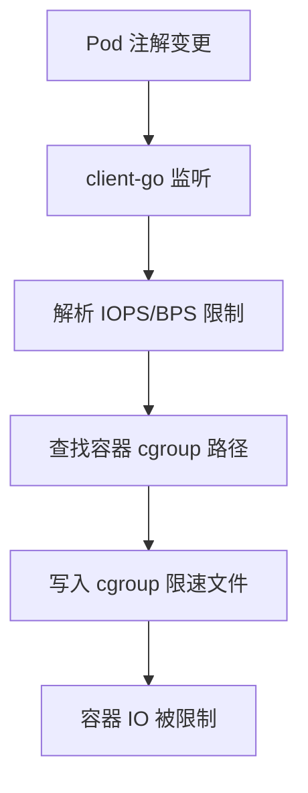
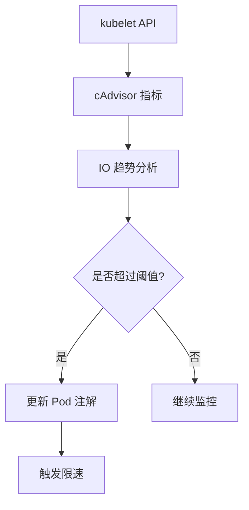

<p align="center">
  
</p>

<h1 align="center">KubeDiskGuard</h1>
<p align="center">Kubernetes 节点级磁盘 IO 资源守护与限速服务</p>

# Kubernetes NVMe 磁盘 IOPS 限速服务

一个基于 Go 语言的 Kubernetes 节点级磁盘 IO 资源守护与限速服务，作为 DaemonSet 运行在每个工作节点上，通过 client-go 监听 Pod 事件，根据 Pod 注解动态调整容器的 IOPS/BPS 限制。

## 核心特性

### 🚀 主要功能
- **动态 IOPS/BPS 限速**: 监听 Pod 时间变化,根据 Pod 注解实时调整容器磁盘 IO 限制
- **智能限速**: 基于 cAdvisor 指标自动检测高 IO 容器并应用限速
- **多运行时支持**: 支持 Docker 和 Containerd 容器运行时
- **cgroup 兼容**: 支持 cgroup v1 和 v2
- **注解驱动**: 通过 Kubernetes Pod 注解配置限速策略
- **kubelet API 集成**: 减少API Server压力，提高性能和可靠性, 通过 kubelet API 获取 cAdvisor 数据，简化复杂度
- **统一数据源**: 智能限速和监控都使用 kubelet API 作为数据源
- **支持多维度过滤**:（关键字、命名空间、正则、K8s label selector）


## 架构图

> KubeDiskGuard 以 DaemonSet agent 方式运行在每个 WorkNode 上，通过 client-go 监听 Kubernetes API Server 的 Pod 事件，**并不是替代 kubelet**，而是作为节点的辅助资源管理服务。




## 工作原理

### 1. 限速机制


### 2. 智能限速流程


### 3. 数据流优化
- **历史方案**: cgroup 文件读取 → 复杂解析 → IO 计算
- **优化方案**: kubelet API → cAdvisor 指标 → 直接计算

## 快速开始

### 1. 部署服务

```bash
# 克隆项目
git clone <repository-url>
cd io-limit-service

# 构建镜像
make build

# 部署 DaemonSet
kubectl apply -f k8s-daemonset.yaml
```

### 2. 配置 Pod 注解

```yaml
apiVersion: v1
kind: Pod
metadata:
  name: example-pod
  annotations:
    # 统一 IOPS 限制
    io-limit: "1000"
    
    # 分别设置读写 IOPS
    io-limit/read: "800"
    io-limit/write: "600"
    
    # 分别设置读写 BPS (字节/秒)
    io-limit/read-bps: "1048576"  # 1MB/s
    io-limit/write-bps: "524288"  # 512KB/s
spec:
  containers:
  - name: app
    image: nginx
```

### 3. 启用智能限速

```yaml
apiVersion: v1
kind: ConfigMap
metadata:
  name: io-limit-config
data:
  config.json: |
    {
      "smart_limit_enabled": true,
      "smart_limit_monitor_interval": 60,
      "smart_limit_high_io_threshold": 0.8,
      "smart_limit_auto_iops": 500,
      "smart_limit_auto_bps": 1048576,
      "smart_limit_annotation_prefix": "io-limit"
    }
```


## 使用说明

### 1. 注解动态调整 IOPS/BPS

在 Pod 的 metadata.annotations 中添加如下注解即可动态调整该 Pod 的 IOPS/BPS 限制：

```yaml
apiVersion: v1
kind: Pod
metadata:
  name: mypod
  annotations:
    io-limit/read-iops: "1200"   # 读IOPS限制
    io-limit/write-iops: "800"   # 写IOPS限制
    # 或统一设置
    io-limit/iops: "1000"        # 读写IOPS都为1000
    # 智能限速注解（自动添加）
    io-limit/smart-limit: "true" # 标识为智能限速
    io-limit/auto-iops: "800"    # 自动计算的IOPS值
    io-limit/auto-bps: "1048576" # 自动计算的BPS值（1MB/s）
    io-limit/limit-reason: "high-io-detected" # 限速原因
```

- 优先级：`read-iops`/`write-iops` > `iops`
- 注解为0表示解除对应方向的IOPS/BPS限速
- 智能限速注解由系统自动添加，用户无需手动设置

### 2. 过滤机制

- **关键字过滤**：`EXCLUDE_KEYWORDS`，如 `pause,istio-proxy`
- **命名空间过滤**：`EXCLUDE_NAMESPACES`，如 `kube-system,monitoring`
- **LabelSelector过滤**：`EXCLUDE_LABEL_SELECTOR`，支持 K8s 原生 label selector 语法，如 `app=system,env in (prod,staging),!debug`

**示例环境变量配置：**

```yaml
env:
  - name: EXCLUDE_KEYWORDS
    value: "pause,istio-proxy"
  - name: EXCLUDE_NAMESPACES
    value: "kube-system,monitoring"
  - name: EXCLUDE_LABEL_SELECTOR
    value: "app=system,env in (prod,staging),!debug"
```

### 3. 主要环境变量

| 环境变量 | 默认值 | 说明 |
|---------|--------|------|
| `NODE_NAME` |  | 必须，节点名，建议通过Downward API注入 |
| `CONTAINER_READ_IOPS_LIMIT` | 500 | 单个容器的读IOPS限制 |
| `CONTAINER_WRITE_IOPS_LIMIT` | 500 | 单个容器的写IOPS限制 |
| `CONTAINER_IOPS_LIMIT` | 500 | 兼容老配置，若未设置read/write则用此值 |
| `DATA_MOUNT` | /data | 数据盘挂载点 |
| `EXCLUDE_KEYWORDS` | pause,istio-proxy,psmdb,kube-system,koordinator,apisix | 排除的容器关键字 |
| `EXCLUDE_NAMESPACES` | kube-system | 排除的命名空间 |
| `EXCLUDE_LABEL_SELECTOR` |  | K8s label selector 语法 |
| `CONTAINER_RUNTIME` | auto | 容器运行时 |
| `CONTAINER_SOCKET_PATH` | | 容器运行时 `socket` 地址 |
| `CGROUP_VERSION` | auto | cgroup 版本 |
| `KUBELET_HOST` | localhost | kubelet API 主机地址 |
| `KUBELET_PORT` | 10250 | kubelet API 端口 |
| `KUBELET_CA_PATH` |  | kubelet API CA证书路径 |
| `KUBELET_CLIENT_CERT_PATH` |  | kubelet API客户端证书路径 |
| `KUBELET_CLIENT_KEY_PATH` |  | kubelet API客户端私钥路径 |
| `KUBELET_TOKEN_PATH` |  | kubelet API Token路径 |
| `KUBELET_SKIP_VERIFY` |  | kubelet API跳过验证 |
| `SMART_LIMIT_ENABLED` | false | 是否启用智能限速功能 |
| `SMART_LIMIT_MONITOR_INTERVAL` | 60 | 智能限速监控间隔（秒） |
| `SMART_LIMIT_HISTORY_WINDOW` | 10 | 智能限速历史数据窗口（分钟） |
| `SMART_LIMIT_HIGH_IO_THRESHOLD` | 0.8 | 智能限速高IO阈值（百分比） |
| `SMART_LIMIT_HIGH_BPS_THRESHOLD` | 0.8 | 智能限速高BPS阈值（字节/秒） |
| `SMART_LIMIT_AUTO_IOPS` | 0 | 智能限速自动IOPS值（0表示基于当前IO计算） |
| `SMART_LIMIT_AUTO_BPS` | 0 | 智能限速自动BPS值（0表示基于当前IO计算） |
| `SMART_LIMIT_ANNOTATION_PREFIX` | io-limit | 智能限速注解前缀 |
| `SMART_LIMIT_USE_KUBELET_API` | false | 是否使用kubelet API获取IO数据 |

#### DaemonSet注入节点名示例：
```yaml
env:
  - name: NODE_NAME
    valueFrom:
      fieldRef:
        fieldPath: spec.nodeName
```

#### IOPS注解优先级说明
- `io-limit/read-iops`、`io-limit/write-iops` 优先于 `io-limit/iops`
- 若都未设置，则用全局环境变量
- 注解为0表示解除限速

#### 智能限速配置示例：

```yaml
env:
  # 启用智能限速
  - name: SMART_LIMIT_ENABLED
    value: "true"
  # 监控间隔60秒
  - name: SMART_LIMIT_MONITOR_INTERVAL
    value: "60"
  # 历史数据窗口10分钟
  - name: SMART_LIMIT_HISTORY_WINDOW
    value: "10"
  # 高IO阈值80%
  - name: SMART_LIMIT_HIGH_IO_THRESHOLD
    value: "0.8"
  # 最小IOPS限速值
  - name: SMART_LIMIT_AUTO_IOPS
    value: "500"
  # 最小BPS限速值（1MB/s）
  - name: SMART_LIMIT_AUTO_BPS
    value: "1048576"
```

### 4. 基础配置

| 配置项 | 默认值 | 说明 |
|--------|--------|------|
| `container_iops_limit` | 500 | 默认 IOPS 限制 |
| `container_read_iops_limit` | 500 | 默认读 IOPS 限制 |
| `container_write_iops_limit` | 500 | 默认写 IOPS 限制 |
| `container_read_bps_limit` | 0 | 默认读 BPS 限制 |
| `container_write_bps_limit` | 0 | 默认写 BPS 限制 |

### 5. 智能限速配置

| 配置项 | 默认值 | 说明 |
|--------|--------|------|
| `smart_limit_enabled` | false | 是否启用智能限速 |
| `smart_limit_monitor_interval` | 60 | 监控间隔（秒） |
| `smart_limit_history_window` | 10 | 历史数据窗口（分钟） |
| `smart_limit_high_io_threshold` | 0.8 | 高 IO 阈值 |
| `smart_limit_auto_iops` | 0 | 自动限速 IOPS 值 |
| `smart_limit_auto_bps` | 0 | 自动限速 BPS 值 |

### 6. kubelet API 配置

| 配置项 | 默认值 | 说明 |
|--------|--------|------|
| `kubelet_host` | localhost | kubelet 主机地址 |
| `kubelet_port` | 10250 | kubelet 端口 |
| `smart_limit_use_kubelet_api` | true | 是否使用 kubelet API |
| `kubelet_skip_verify` | false | 是否跳过证书验证 |

## 监控与调试

### 查看服务日志
```bash
# 查看 DaemonSet 日志
kubectl logs -n kube-system -l app=io-limit-service

# 查看特定节点日志
kubectl logs -n kube-system -l app=io-limit-service -o wide | grep <node-name>
```

### 检查 cgroup 限速
```bash
# 进入容器查看 cgroup 限制
docker exec -it <container-id> cat /sys/fs/cgroup/blkio/blkio.throttle.read_iops_device
docker exec -it <container-id> cat /sys/fs/cgroup/blkio/blkio.throttle.write_iops_device
```

### 测试 kubelet API
```bash
# 测试 kubelet API 连接
curl -k https://localhost:10250/stats/summary

# 测试 cAdvisor 指标
curl -k https://localhost:10250/metrics/cadvisor
```

## 故障排除

### 常见问题

1. **kubelet API 连接失败**
   - 检查 kubelet 是否运行在 10250 端口
   - 确认 ServiceAccount 权限
   - 检查证书配置

2. **cgroup 限速不生效**
   - 确认 cgroup 版本 (v1/v2)
   - 检查容器运行时支持
   - 验证设备 major:minor 号

3. **智能限速不触发**
   - 检查监控间隔配置
   - 确认 IO 阈值设置
   - 查看历史数据收集

4. 权限问题
确保容器以特权模式运行：
```yaml
securityContext:
  privileged: true
  runAsUser: 0
  runAsGroup: 0
```

5. 设备号获取失败
检查数据盘挂载点：
```bash
df /data
lsblk -no PKNAME $(df /data | tail -1 | awk '{print $1}')
```

6. cgroup 路径不存在
检查 cgroup 版本和路径：
```bash
# 检查 cgroup 版本
ls /sys/fs/cgroup/cgroup.controllers
# 查找容器 cgroup 路径
find /sys/fs/cgroup -name "*[container-id]*"
```

## 开发指南

### 项目结构
```
├── cmd/                    # 命令行工具
├── pkg/
│   ├── cgroup/            # cgroup 限速操作
│   ├── config/            # 配置管理
│   ├── container/         # 容器运行时接口
│   ├── detector/          # 运行时检测
│   ├── kubeclient/        # Kubernetes 客户端
│   ├── kubelet/           # kubelet API 客户端
│   ├── runtime/           # 容器运行时实现
│   ├── service/           # 主服务逻辑
│   └── smartlimit/        # 智能限速模块
├── docs/                  # 文档
├── examples/              # 示例配置
└── scripts/               # 部署脚本
```

### 构建测试
```bash
# 运行单元测试
go test ./...

# 构建二进制文件
make build

# 运行集成测试
make test-integration
```

## 贡献指南

欢迎提交 Issue 和 Pull Request！

1. Fork 项目
2. 创建功能分支
3. 提交更改
4. 推送到分支
5. 创建 Pull Request


## 更新日志

### v2.0.0 (最新)
- 🚀 **智能限速功能重大升级**: 新增完整的智能限速功能，支持自动监控容器IO使用情况并动态调整限速
- 📊 **kubelet API集成**: 新增kubelet API客户端，支持通过kubelet API获取容器IO统计信息
- 🔧 **cAdvisor计算器**: 新增cAdvisor指标计算模块，支持IOPS和BPS趋势分析
- 📚 **文档完善**: 新增智能限速指南、kubelet API集成文档等完整文档体系
- 🛠️ **开发工具**: 新增测试工具和脚本，支持高级测试场景

### v1.x.x
- 初始版本功能实现
- 基础 IOPS/BPS 限速
- 智能限速功能
- 多运行时支持

## 文档导航

- [用户手册（使用说明、注解/环境变量配置、FAQ）](./docs/USER_GUIDE.md)
- [开发手册（架构、主流程、扩展开发）](./docs/DEV_GUIDE.md)
- [部署手册（镜像构建、DaemonSet部署、生产实践）](./docs/DEPLOY_GUIDE.md)
- [变更历史](./docs/CHANGELOG.md)
- [v2.2.0详细变更日志](./docs/V2.2.0_CHANGELOG_DETAILED.md)
- [文档更新总结（注解前缀变更详情）](./docs/DOCUMENTATION_UPDATE_SUMMARY.md)

## 许可证

MIT License
