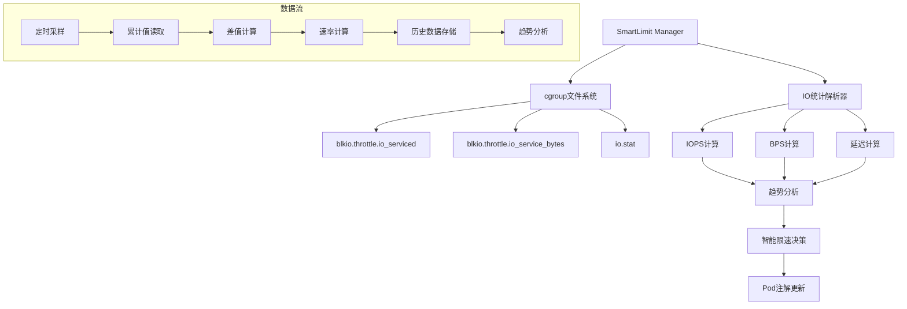
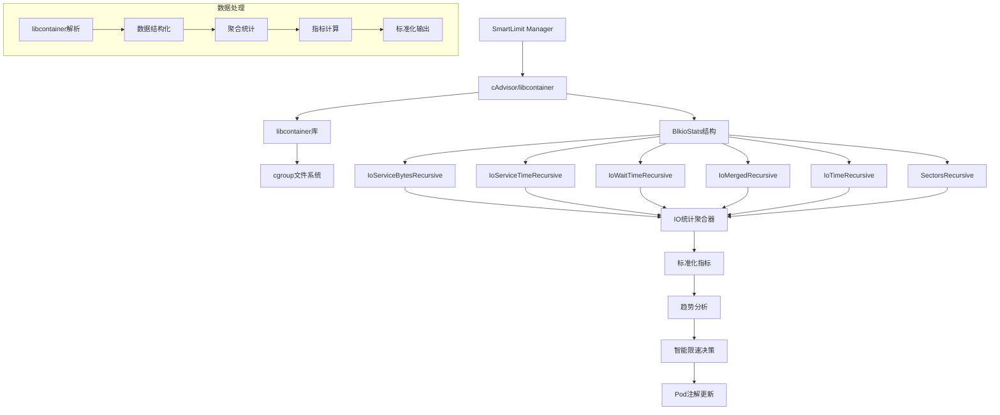
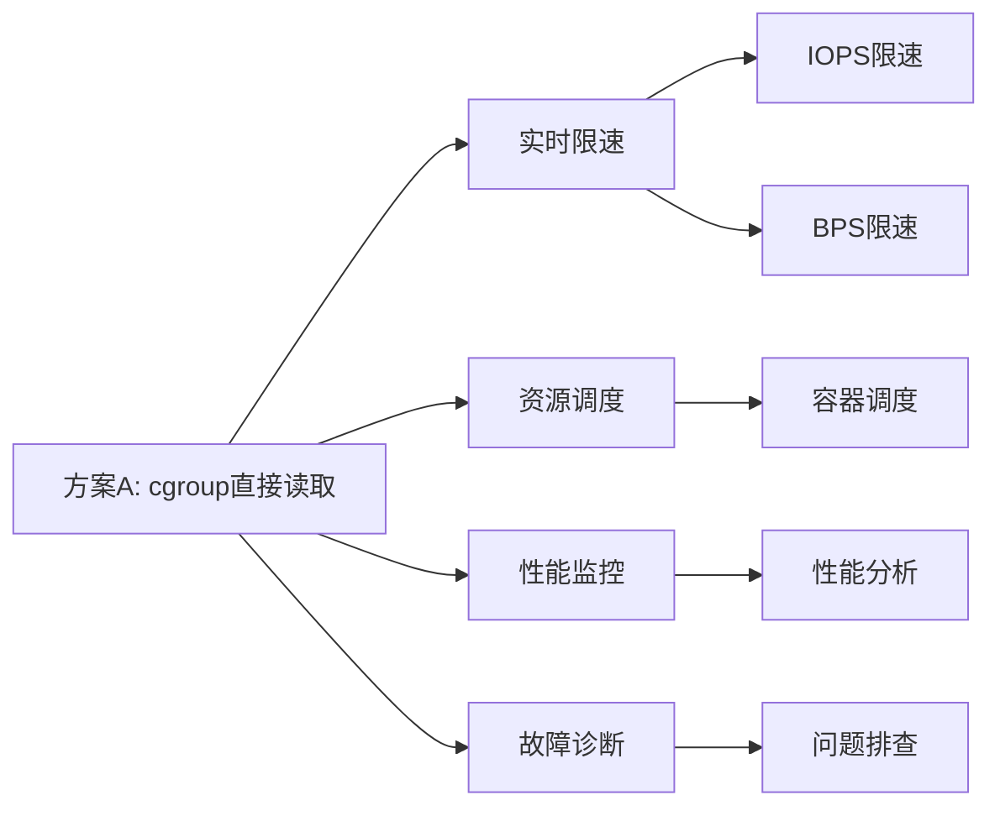
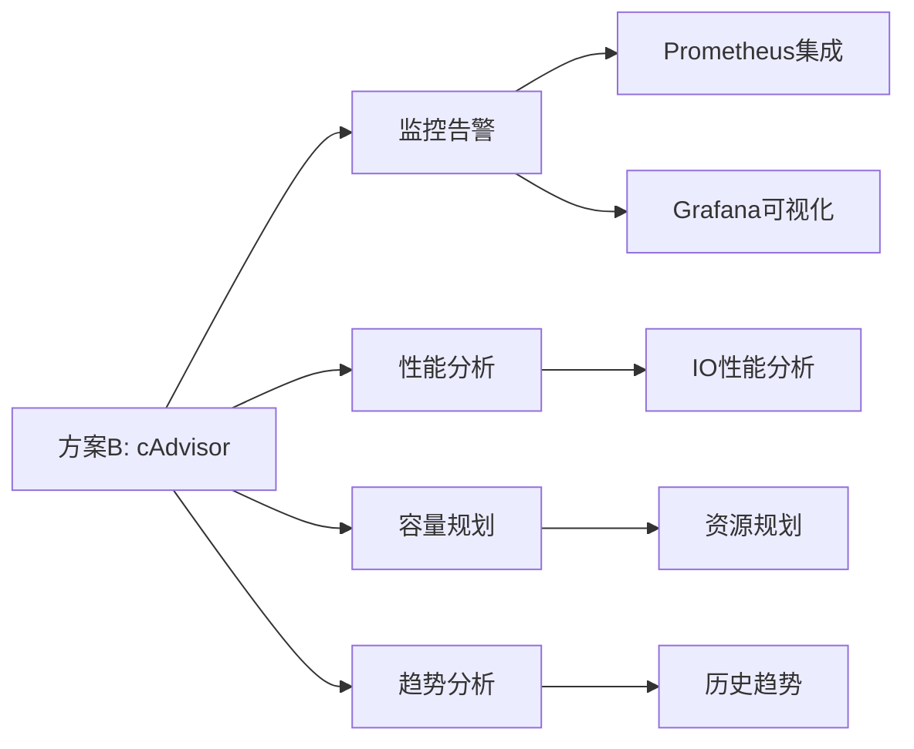
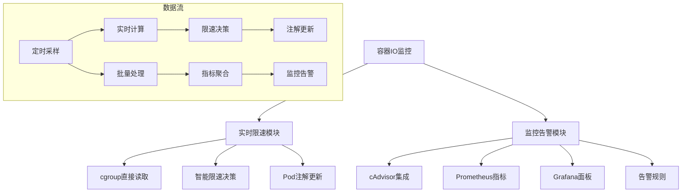

# cgroup vs cAdvisor IO统计方案对比分析

## 目录

1. [概述](#概述)
2. [架构对比](#架构对比)
3. [数据来源对比](#数据来源对比)
4. [算法实现对比](#算法实现对比)
5. [统计维度对比](#统计维度对比)
6. [性能与精度对比](#性能与精度对比)
7. [使用场景对比](#使用场景对比)
8. [最佳实践建议](#最佳实践建议)

---

## 概述

本文档详细对比了KubeDiskGuard项目中智能限速功能使用的cgroup直接读取方案与Kubernetes生态中cAdvisor方案的差异。通过对比分析，帮助开发者理解两种方案的特点、适用场景和选择依据。

### 核心问题

在实现容器IO监控和智能限速时，面临两种主要方案：
- **方案A**：直接读取cgroup文件系统，计算IO统计
- **方案B**：使用cAdvisor/libcontainer库，获取标准化的IO统计

---

## 架构对比

### 方案A：cgroup直接读取架构



### 方案B：cAdvisor架构



---

## 数据来源对比

### 方案A：cgroup直接读取

#### cgroup v1 文件格式

```bash
# /sys/fs/cgroup/blkio/<container>/blkio.throttle.io_serviced
8:0 Read  123456
8:0 Write 654321

# /sys/fs/cgroup/blkio/<container>/blkio.throttle.io_service_bytes  
8:0 Read  123456789
8:0 Write 987654321
```

**字段说明：**
- `8:0`：设备号（主:次）
- `Read/Write`：操作类型
- 数值：累计IO次数或字节数

#### cgroup v2 文件格式

```bash
# /sys/fs/cgroup/<container>/io.stat
8:0 rbytes=123456789 wbytes=987654321 rios=123456 wios=654321 rlat=1234 wlat=5678
```

**字段说明：**
- `rbytes/wbytes`：累计读/写字节数
- `rios/wios`：累计读/写IO次数
- `rlat/wlat`：累计读/写延迟（微秒）

#### 代码实现

```go
// pkg/cgroup/cgroup.go
func (m *Manager) GetIOStats(cgroupPath string) (*IOStats, error) {
    if m.version == "v1" {
        return m.getIOStatsV1(cgroupPath, stats)
    } else {
        return m.getIOStatsV2(cgroupPath, stats)
    }
}

func (m *Manager) getIOStatsV1(cgroupPath string, stats *IOStats) (*IOStats, error) {
    // 读取IOPS统计
    readFile := filepath.Join(cgroupPath, "blkio.throttle.io_serviced")
    if data, err := os.ReadFile(readFile); err == nil {
        stats.ReadIOPS, stats.WriteIOPS = parseIOPSV1(string(data))
    }
    
    // 读取BPS统计
    writeFile := filepath.Join(cgroupPath, "blkio.throttle.io_service_bytes")
    if data, err := os.ReadFile(writeFile); err == nil {
        stats.ReadBPS, stats.WriteBPS = parseBPSV1(string(data))
    }
    
    return stats, nil
}

func (m *Manager) getIOStatsV2(cgroupPath string, stats *IOStats) (*IOStats, error) {
    ioStatFile := filepath.Join(cgroupPath, "io.stat")
    if data, err := os.ReadFile(ioStatFile); err == nil {
        return parseIOStatsV2(string(data), stats), nil
    }
    return stats, nil
}
```

### 方案B：cAdvisor/libcontainer

#### 数据结构

```go
// cAdvisor使用的BlkioStats结构
type BlkioStats struct {
    IoServiceBytesRecursive []BlkioStatEntry
    IoServiceTimeRecursive  []BlkioStatEntry
    IoWaitTimeRecursive     []BlkioStatEntry
    IoMergedRecursive       []BlkioStatEntry
    IoTimeRecursive         []BlkioStatEntry
    SectorsRecursive        []BlkioStatEntry
}

type BlkioStatEntry struct {
    Major uint64 `json:"major"`
    Minor uint64 `json:"minor"`
    Op    string `json:"op"`
    Value uint64 `json:"value"`
}
```

#### 数据来源

```go
// cAdvisor通过libcontainer读取cgroup数据
import (
    "github.com/opencontainers/runc/libcontainer/cgroups"
)

func getCadvisorStats(cgroupPath string) (*cgroups.Stats, error) {
    // 使用libcontainer库读取cgroup统计
    manager, err := cgroups.Load(cgroups.V1, cgroups.StaticPath(cgroupPath))
    if err != nil {
        return nil, err
    }
    
    stats, err := manager.GetStats()
    if err != nil {
        return nil, err
    }
    
    return stats, nil
}
```

---

## 算法实现对比

### 方案A：cgroup直接读取算法

#### 采样算法

```go
// pkg/smartlimit/smartlimit.go
func (m *SmartLimitManager) collectIOStats() {
    pods, err := m.kubeClient.ListNodePodsWithKubeletFirst()
    if err != nil {
        log.Printf("Failed to get node pods: %v", err)
        return
    }

    for _, pod := range pods {
        if !m.shouldMonitorPod(pod) {
            continue
        }

        for _, container := range pod.Status.ContainerStatuses {
            if container.ContainerID == "" {
                continue
            }

            containerID := parseContainerID(container.ContainerID)
            cgroupPath := m.cgroupMgr.FindCgroupPath(containerID)
            
            if cgroupPath == "" {
                continue
            }

            // 直接读取cgroup统计
            stats, err := m.cgroupMgr.GetIOStats(cgroupPath)
            if err != nil {
                log.Printf("Failed to get IO stats for container %s: %v", containerID, err)
                continue
            }

            stats.ContainerID = containerID
            m.addIOStats(containerID, pod.Name, pod.Namespace, stats)
        }
    }
}
```

#### 速率计算算法

```go
// 基于相邻采样点的差值计算速率
func (m *SmartLimitManager) calculateIOTrend(stats []*cgroup.IOStats) *IOTrend {
    trend := &IOTrend{}
    now := time.Now()
    
    // 计算15分钟、30分钟、60分钟的平均IOPS和BPS
    intervals := []struct {
        duration time.Duration
        readIOPS *float64
        writeIOPS *float64
        readBPS *float64
        writeBPS *float64
    }{
        {15 * time.Minute, &trend.ReadIOPS15m, &trend.WriteIOPS15m, &trend.ReadBPS15m, &trend.WriteBPS15m},
        {30 * time.Minute, &trend.ReadIOPS30m, &trend.WriteIOPS30m, &trend.ReadBPS30m, &trend.WriteBPS30m},
        {60 * time.Minute, &trend.ReadIOPS60m, &trend.WriteIOPS60m, &trend.ReadBPS60m, &trend.WriteBPS60m},
    }

    for _, interval := range intervals {
        cutoff := now.Add(-interval.duration)
        var totalReadIOPS, totalWriteIOPS, totalReadBPS, totalWriteBPS int64
        var count int

        for i := 1; i < len(stats); i++ {
            if stats[i].Timestamp.After(cutoff) {
                // 计算增量
                readIOPS := stats[i].ReadIOPS - stats[i-1].ReadIOPS
                writeIOPS := stats[i].WriteIOPS - stats[i-1].WriteIOPS
                readBPS := stats[i].ReadBPS - stats[i-1].ReadBPS
                writeBPS := stats[i].WriteBPS - stats[i-1].WriteBPS
                
                timeDiff := stats[i].Timestamp.Sub(stats[i-1].Timestamp).Seconds()
                if timeDiff > 0 {
                    // 计算速率
                    totalReadIOPS += int64(float64(readIOPS) / timeDiff)
                    totalWriteIOPS += int64(float64(writeIOPS) / timeDiff)
                    totalReadBPS += int64(float64(readBPS) / timeDiff)
                    totalWriteBPS += int64(float64(writeBPS) / timeDiff)
                    count++
                }
            }
        }

        if count > 0 {
            *interval.readIOPS = float64(totalReadIOPS) / float64(count)
            *interval.writeIOPS = float64(totalWriteIOPS) / float64(count)
            *interval.readBPS = float64(totalReadBPS) / float64(count)
            *interval.writeBPS = float64(totalWriteBPS) / float64(count)
        }
    }

    return trend
}
```

### 方案B：cAdvisor算法

#### 数据解析算法

```go
// cAdvisor使用libcontainer解析cgroup数据
func parseCadvisorStats(stats *cgroups.Stats) *IOStats {
    result := &IOStats{
        Timestamp: time.Now(),
    }
    
    if stats.BlkioStats == nil {
        return result
    }
    
    // 解析IoServiceBytesRecursive
    for _, entry := range stats.BlkioStats.IoServiceBytesRecursive {
        switch entry.Op {
        case "Read":
            result.ReadBPS += int64(entry.Value)
        case "Write":
            result.WriteBPS += int64(entry.Value)
        }
    }
    
    // 解析IoServiceTimeRecursive
    for _, entry := range stats.BlkioStats.IoServiceTimeRecursive {
        switch entry.Op {
        case "Read":
            result.ReadLatency += int64(entry.Value)
        case "Write":
            result.WriteLatency += int64(entry.Value)
        }
    }
    
    // 计算IOPS（需要两次采样计算差值）
    // 这里只是示例，实际需要保存历史数据
    return result
}
```

#### 聚合统计算法

```go
// cAdvisor的聚合统计
func aggregateCadvisorStats(entries []BlkioStatEntry) map[string]uint64 {
    result := make(map[string]uint64)
    
    for _, entry := range entries {
        key := fmt.Sprintf("%d:%d:%s", entry.Major, entry.Minor, entry.Op)
        result[key] += entry.Value
    }
    
    return result
}
```

---

## 统计维度对比

### 方案A：cgroup直接读取统计维度

```go
type IOStats struct {
    ContainerID string
    Timestamp   time.Time
    ReadIOPS    int64    // 读IOPS
    WriteIOPS   int64    // 写IOPS
    ReadBPS     int64    // 读BPS
    WriteBPS    int64    // 写BPS
    ReadLatency int64    // 读延迟（微秒）
    WriteLatency int64   // 写延迟（微秒）
}
```

**统计维度：**
- ✅ 基础IOPS统计（读/写）
- ✅ 基础BPS统计（读/写）
- ✅ 基础延迟统计（读/写）
- ❌ 无IO合并统计
- ❌ 无IO队列深度统计
- ❌ 无IO等待时间统计
- ❌ 无扇区统计

### 方案B：cAdvisor统计维度

```go
type BlkioStats struct {
    // 按设备统计的IO字节数
    IoServiceBytesRecursive []BlkioStatEntry
    // 按设备统计的IO服务时间
    IoServiceTimeRecursive  []BlkioStatEntry
    // 按设备统计的IO等待时间
    IoWaitTimeRecursive     []BlkioStatEntry
    // 按设备统计的合并IO数
    IoMergedRecursive       []BlkioStatEntry
    // 按设备统计的IO时间
    IoTimeRecursive         []BlkioStatEntry
    // 按设备统计的扇区数
    SectorsRecursive        []BlkioStatEntry
}
```

**统计维度：**
- ✅ 基础IOPS统计（读/写）
- ✅ 基础BPS统计（读/写）
- ✅ 基础延迟统计（读/写）
- ✅ IO合并统计
- ✅ IO队列深度统计
- ✅ IO等待时间统计
- ✅ 扇区统计
- ✅ 按设备聚合统计

---

## 性能与精度对比

### 性能对比

| 对比项 | 方案A：cgroup直接读取 | 方案B：cAdvisor |
|--------|----------------------|-----------------|
| **CPU开销** | 低（直接文件读取） | 中（库解析开销） |
| **内存开销** | 低（简单数据结构） | 中（复杂数据结构） |
| **依赖复杂度** | 无外部依赖 | 依赖libcontainer库 |
| **启动时间** | 快 | 中（库初始化） |
| **运行时性能** | 高 | 中 |

### 精度对比

| 对比项 | 方案A：cgroup直接读取 | 方案B：cAdvisor |
|--------|----------------------|-----------------|
| **数据精度** | 原始精度 | 经过库处理 |
| **误差来源** | 采样间隔、容器重启 | 库解析、数据转换 |
| **统计一致性** | 与内核一致 | 依赖库实现 |
| **设备热插拔** | 直接反映 | 依赖库处理 |

### 精度分析代码

```go
// 方案A精度分析
func analyzePrecisionA(samples []*IOStats) {
    for i := 1; i < len(samples); i++ {
        timeDiff := samples[i].Timestamp.Sub(samples[i-1].Timestamp)
        
        // 计算IOPS精度
        readIOPSDelta := samples[i].ReadIOPS - samples[i-1].ReadIOPS
        readIOPSRate := float64(readIOPSDelta) / timeDiff.Seconds()
        
        // 计算BPS精度
        readBPSDelta := samples[i].ReadBPS - samples[i-1].ReadBPS
        readBPSRate := float64(readBPSDelta) / timeDiff.Seconds()
        
        log.Printf("Sample %d: IOPS=%.2f, BPS=%.2f", i, readIOPSRate, readBPSRate)
    }
}

// 方案B精度分析
func analyzePrecisionB(stats []*cgroups.Stats) {
    for i, stat := range stats {
        if stat.BlkioStats == nil {
            continue
        }
        
        // 分析各种统计维度的一致性
        for _, entry := range stat.BlkioStats.IoServiceBytesRecursive {
            log.Printf("Device %d:%d %s: %d bytes", 
                entry.Major, entry.Minor, entry.Op, entry.Value)
        }
    }
}
```

---

## 使用场景对比

### 方案A适用场景



**优势：**
- ✅ 实时性强，适合限速场景
- ✅ 实现简单，维护成本低
- ✅ 无外部依赖，部署简单
- ✅ 性能开销小

**劣势：**
- ❌ 统计维度有限
- ❌ 需要自己实现复杂统计
- ❌ 与现有监控体系集成困难

### 方案B适用场景



**优势：**
- ✅ 统计维度丰富
- ✅ 与K8s生态集成好
- ✅ 标准化程度高
- ✅ 支持复杂分析

**劣势：**
- ❌ 实时性较差
- ❌ 依赖复杂
- ❌ 性能开销大
- ❌ 不适合实时限速

---

## 最佳实践建议

### 混合方案架构



### 推荐实现方案

```go
// 混合方案实现
type HybridIOMonitor struct {
    // 实时限速使用cgroup直接读取
    realtimeMonitor *SmartLimitManager
    
    // 监控告警使用cAdvisor
    cadvisorMonitor *CadvisorMonitor
    
    // 配置
    config *Config
}

func (h *HybridIOMonitor) Start() error {
    // 启动实时限速监控
    if h.config.EnableRealtimeLimit {
        go h.realtimeMonitor.Start()
    }
    
    // 启动监控告警
    if h.config.EnableMonitoring {
        go h.cadvisorMonitor.Start()
    }
    
    return nil
}

// 实时限速配置
type RealtimeConfig struct {
    Enabled           bool
    MonitorInterval   time.Duration
    HighIOThreshold   float64
    HighBPSThreshold  float64
}

// 监控告警配置
type MonitoringConfig struct {
    Enabled           bool
    PrometheusEnabled bool
    AlertEnabled      bool
    MetricsInterval   time.Duration
}
```

### 配置示例

```yaml
# 混合方案配置
apiVersion: v1
kind: ConfigMap
metadata:
  name: io-monitor-config
data:
  # 实时限速配置
  realtime.enabled: "true"
  realtime.monitor_interval: "60"
  realtime.high_io_threshold: "1000"
  realtime.high_bps_threshold: "1048576"
  
  # 监控告警配置
  monitoring.enabled: "true"
  monitoring.prometheus_enabled: "true"
  monitoring.alert_enabled: "true"
  monitoring.metrics_interval: "300"
```

### 选择建议

| 场景 | 推荐方案 | 理由 |
|------|----------|------|
| **纯限速场景** | 方案A（cgroup直接读取） | 实时性强，实现简单 |
| **纯监控场景** | 方案B（cAdvisor） | 统计丰富，生态完善 |
| **混合场景** | 混合方案 | 兼顾实时性和丰富性 |
| **资源受限** | 方案A | 性能开销小 |
| **企业级部署** | 混合方案 | 功能完整，可扩展 |

---

## 总结

通过详细对比分析，我们可以得出以下结论：

1. **方案A（cgroup直接读取）**适合实时限速场景，具有实时性强、实现简单、性能好的特点。

2. **方案B（cAdvisor）**适合监控告警场景，具有统计维度丰富、生态集成好的特点。

3. **混合方案**能够兼顾两种场景的需求，是最佳实践选择。

4. 在实际部署中，应根据具体需求选择合适的方案，或者采用混合方案来满足不同场景的需求。

---

## 参考资料

- [cgroup v1 文档](https://www.kernel.org/doc/Documentation/cgroup-v1/blkio-controller.txt)
- [cgroup v2 文档](https://www.kernel.org/doc/Documentation/admin-guide/cgroup-v2.rst)
- [cAdvisor 文档](https://github.com/google/cadvisor)
- [libcontainer 文档](https://github.com/opencontainers/runc/tree/main/libcontainer)
- [Kubernetes 监控最佳实践](https://kubernetes.io/docs/tasks/debug-application-cluster/resource-usage-monitoring/) 